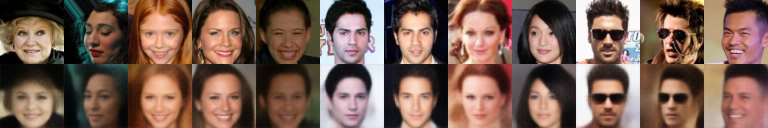
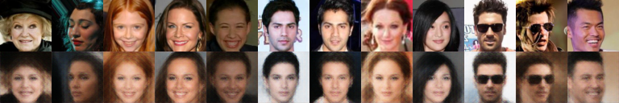

# Deep Feature Consistent VAE With PaddlePaddle


## 1.Download CelebA and Pretrained VGG19

Download CelebA [@AI Studio CelebA](https://aistudio.baidu.com/aistudio/datasetdetail/39207)
and put data at ./dataset

Download VGG19_bn [@torch](https://download.pytorch.org/models/vgg19_bn-c79401a0.pth)
and put data at ./paddle_dfcvae/architectures/pretrained

then 
```shell
sh preparedata.sh
```

## 2.Train paddle dfcvae
```shell
cd ./paddle_dfcvae
python trainer.py
```
## chose vgg layer feature

```shell
vim  extract_features @ ./paddle_dfcvae/architectures/dfcvae.py
```

## 3.Generated imgs
```shell
python generatedImg.py
```


## 4.Reconstruct

vae123



vae345


vae123 extract the low features，clearer than vae345

## 5.Generated


## 6.Logs , Models and More Imgs
[BaiduYun](https://pan.baidu.com/s/10pEEjD-R8M_F7Rw1JxJBew) (password: 9vs9)

19967 Reconstruct pics(2x10)

100 Generated pics(10x1)

## 7.Measure
IS:

|  mean    | std     |
| ---- | ---- |
| 1.1636 |  0.0221 |

